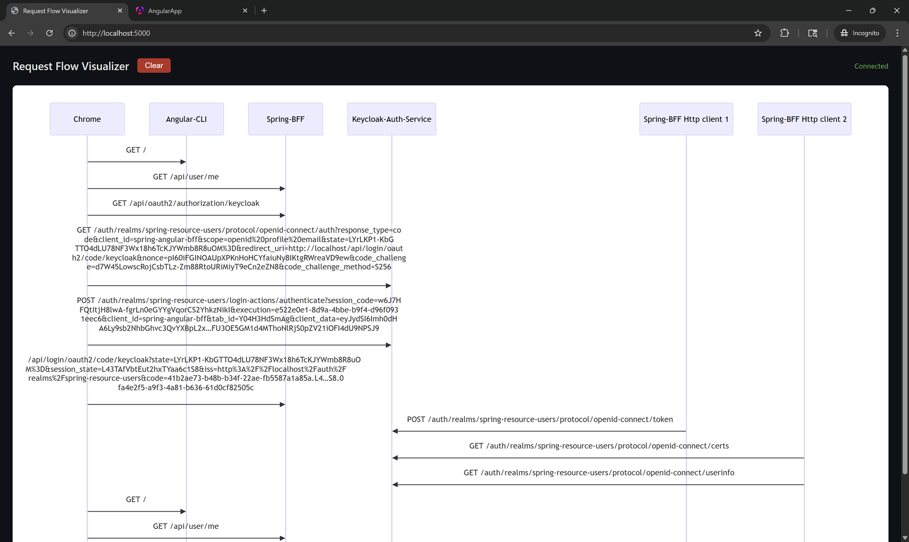

# Request Flow Visualizer

## About

A real-time network request flow visualizer.

Captures HTTP request data from an external source, filters it, and displays it as a Mermaid sequence diagram in the browser.

### How It Works

1. Request to `POST /capture` with request metadata from an external instrumentation tool (nginx + NJS mirror forwarder used in this project)
2. Automatically filters out noise (CSS, JS bundles, favicons, debug requests).
3. Persists request data in memory and resolves friendly names for services from hard-coded mappings.
4. Starts Server-Sent Event stream at `GET /events/listen` to send captured requests to browser.
5. Display request flows as sequence diagrams using Mermaid.js.

## Install and Run

Install dependencies:
```bash
pnpm install
```

Start the server:
```bash
pnpm start
```

Open `http://localhost:5000` in a browser to view visualizer.

## Screenshot


